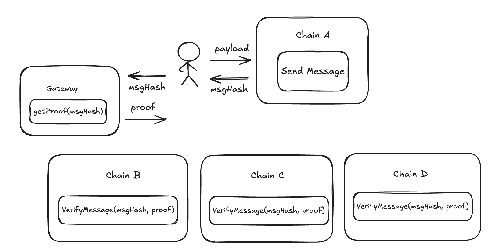
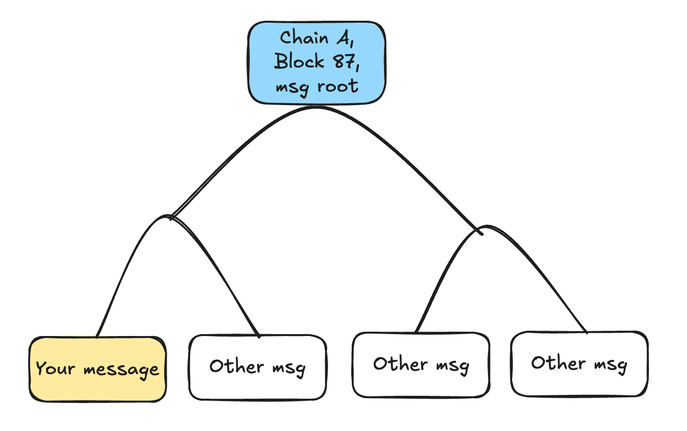
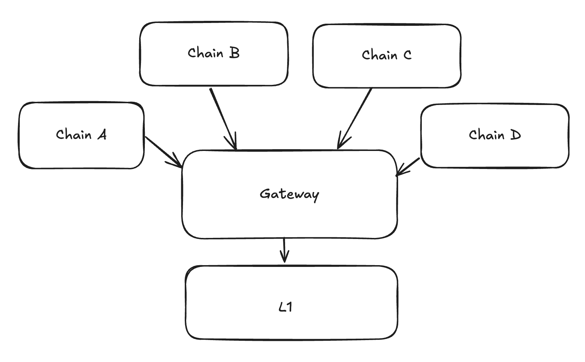

# InteropExplained - ep 2 - Basic messages

In this article, we’re going to cover the lowest level of the interop stack - Interop Messages - the interface that all other things are build on.

We’ll look at the details of the interface, some use cases.

This is an ‘advanced’ document - as most users and app developers would usually interact with higher levels of interop, but it is still worth to see how the internals look like.

## Basics


Interop Messages are the lowest level of our stack.

InteropMessage contains ‘data’ and it offers two methods:

- send a message
- verify that a given message was sent on some chain

Notice, that the message itself doesn’t have any ‘destination chain’ or address - it is simply a payload that a user (or contract) is creating. Think about it as a ‘broadcast’.

The `InteropCenter` is a contract, that is pre-deployed on all the chains on a fixed address `0x00..010008`

```solidity
contract InteropCenter {
  // Sends interop message. Can be called by anyone.
  // Returns the unique interopHash.
	function sendInteropMessage(bytes data) returns interopHash;

  // Interop message - uniquely identified by the hash of the payload.
	struct InteropMessage {
	  bytes data;
	  address sender; // filled by InteropCenter
	  uint256 sourceChainId; // filled by InteropCenter
	  uint256 messageNum; // a 'nonce' to guarantee different hashes.
	}

	// Verifies if such interop message was ever producted.
	function verifyInteropMessage(bytes32 interopHash, Proof merkleProof) return bool;
}
```

When you call the `sendInteropMessage`, the `InteropCenter` will add some additional fields (like your sender address, source chain id and messageNum - which acts as a nonce to guarantee that the hash of this struct is globally unique) - and return you the `interopHash`.

This is now a globally unique identifier, that you can use on any chain in the network, to call the `verifyInteropMessage`.



A message created on one chain can be verified on any other chain.

**How do I get the proof**

You can notice that `verifyInteropMessage` has a second argument - a proof, that you have to pass. This proof is a merkle tree proof (more details below) - and you can get it by querying the [chain](https://docs.zksync.io/build/api-reference/zks-rpc#zks_getl2tol1msgproof) (note image is incorrect), or you can build it yourself off-chain - by looking at the chain's state on L1.

**How does the interop message differ from other layers (InteropTransactions, InteropCalls)**
Interop message (as the most basic layer), doesn’t have any additional features - no support for picking destination chains, no support for nullifiers/replays, no cancellation etc.

If you need any of these, you might consider integrating on the higher layer of the interop (Call or Bundle) instead.

## Simple use case

Before we dive into the details of how the system works, let’s see a simple use case of the Dapp, that would decide to use InteropMessage.

For our example, let’s imagine the very trivial cross-chain contract - where you can call `signup()` method on chain B, C and D only if someone called `signup_open()` on chain A.

```solidity
// Contract deployed on chain A.
contract SignupManager {
  public bytes32 sigup_open_msg_hash;
  function signup_open() onlyOwner {
    // We are open for business
    signup_open_msg_hash = InteropCenter(INTEROP_CENTER_ADDRESS).sendInteropMessage("We are open");
  }
}

// Contract deployed on all other chains.
contract SignupContract {
  public bool signupIsOpen;
  // Anyone can call it.
  function openSignup(InteropMessage message, InteropProof proof) {
    InteropCenter(INTEROP_CENTER_ADDRESS).verifyInteropMessage(keccak(message), proof);
    require(message.sourceChainId == CHAIN_A_ID);
    require(message.sender == SIGNUP_MANAGER_ON_CHAIN_A);
    require(message.data == "We are open");
	  signupIsOpen = true;
  }

  function signup() {
     require(signupIsOpen);
     signedUpUser[msg.sender] = true;
  }
}
```

In the example above, the signupManager on chain A, is calling the `signup_open` method. Then any user on other chains, can get the `signup_open_msg_hash` , get the necessary proof, and call the `openSignup` function on any destination chain.

## Deeper technical dive

Let’s see what’s happening inside InteropCenter when new interop message is created.

```solidity
function sendInteropMessage(bytes data) {
  messageNum += 1;
  msg = InteropMessage({data, msg.sender, block.chain_id, messageNum});
  // Does L2->L1 Messaging.
  sendToL1(abi.encode(msg));
  return keccak(msg);
}
```

As you can see, it fills the necessary data, and then calls the `sendToL1` method.

The `sendToL1` is a system contract, that collects all these messages, creates a merkle tree out of them at the end of the batch, and sends them to the settlement layer (L1 or Gateway) when it commits the batch.
To see an exact description of the Merkle root structure read the [nested l3 l1 messaging doc](../../gateway/nested_l3_l1_messaging.md).



The settlment layer receives the messages and once the proof for the batch is submitted (or to be more correct the ‘execute’ step), it will add the root of this merkle tree to its `globalRoot`.


`globalRoot` is the root of the merkle tree, that contains all the messages from all the chains and each chain is regularly reading its value from settlment layer.



Each chain is regularly syncing data from its settlement layers, and fetches that globalRoot at this time.

If a user now wants to call the `verifyInteropMessage` on some chain, they first have to ask the chain for the merkle path from the batch that they are interested into, up to the `globalRoot`. Afterwards, they can simply provide this path when calling a method on the destination chain (in our case the `openSignup` method).


Note the chain root across batches is missing from this image.

**What if Chain doesn’t provide the proof?**

In such scenario, user can re-create the merkle proof, based on the L1 data. As each interopMessage is sent there too.

**Global roots change every second**

Yes, as new chains are proving their blocks, the global root keeps changing. The chains will keep some number of historical global roots (around 24h), so that the Merkle path that you just generated stays valid.

**Is this secure? could chain D operator just use a different global root?**

Yes. If chain D operator was malicious, and tried to use a different global root, they would not be able to submit the proof of their new batch to the settlment layer - as part of the proof’s public input is the global root.
