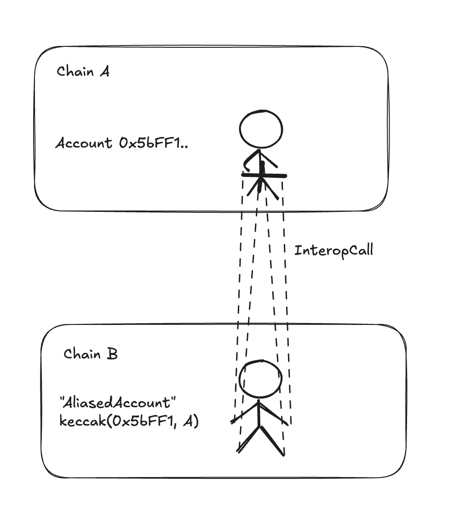
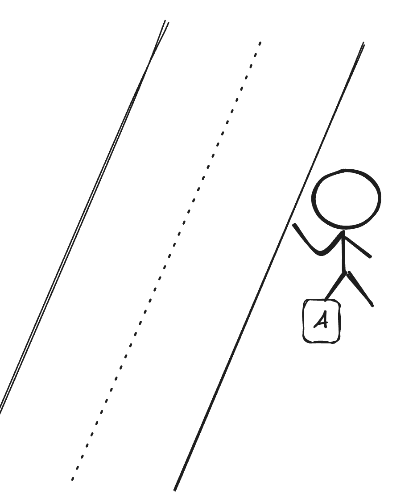

# InteropExplained - ep 3 - Bundles & Calls

# Basics Calls

Interop Calls are the next level of interfaces (built on top of Interop Messages) - that allow you to call contracts on other chains.


On this level, the system will take care of replayability protection - once a call is successful, it will never be executed again (so you don’t need to have your own nullifiers etc).

Also these calls will be coming from ‘aliased accounts’ - to make it easier for you to manage permissions. (see below for more details).

The cancellations and retries are handled on the next level (bundles) described in the next section.

## Interface

On the sending side, the interface offers you the option to send this ‘call’ to the destination contract.

```solidity
struct InteropCall {
	address sourceSender,
	address destinationAddress,
	uint256 destinationChainId,
	calldata data,
	uint256 value
}
contract InteropCenter {
	// On source chain.
  // Sends a 'single' basic internal call to destination chain & address.
  // Internally, it starts a bundle, adds this call and sends it over.
  function sendCall(destinationChain, destinationAddress, calldata, msgValue) returns bytes32 bundleId;
}
```

What you get in return is a `bundleId` (we’ll explain bundles below, for now think about it as unique identifier of your call).

On the destination chain, you can call the execute method:

```solidity
contract InteropCenter {
  // Executes a given bundle.
  // interopMessage is the message that contains your bundle as payload.
  // If it fails, it can be called again.
  function executeInteropBundle(interopMessage, proof);
  // If the bundle didn't execute succesfully yet, it can be marked as cancelled.
  // See details below.
  function cancelInteropBundle(interopMessage, proof);
}
```

You can get the `interopMessage` (that will contain your whole payload) from the chain, or you can construct it yourself based on L1 data.

What this will do under the hood, is to call the `destinationAddress` with the given calldata.

Which raises the question — **who is the msg.sender of this call?**

## **msg.sender of the destination call**

The msg.sender on the destination chain will be `AliasedAccount` - which is an address that is created as a hash of the original sender and original source chain.

(Normally we’d like to use `sourceAccount@sourceChain` - but as ethereum limits the size of addresses to 20 bytes, we compute the keccak of the string above, and use this as the address).

One way to think about it, is you (as account 0x5bFF1… on chain A) can send a call to some contract on a destination chain, and for that contract, it would look like it was a local call coming from the address `keccak(0x5bFF1 || A)` . This means that you are ‘controlling’ such account address on **every ZKChain** by sending interop messages from the `0x5bFF1..` account on chain A.



## Simple example

Imagine you have contracts on chains B, C and D, and you’d like them to send ‘reports’ every time a customer buys something to the Headquarters (HQ) contract on chain A.

```solidity
// Deployed on chains B, C, D.
contract Shop {
	/// Called by the customers when they buy something.
	function buy(uint256 itemPrice) {
	  // handle payment etc.
	  ...
	  // report to HQ
	  InteropCenter(INTEROP_ADDRESS).sendCall(
		  324,       // chain id of chain A,
		  0xc425..,  // HQ contract on chain A,
		  createCalldata("reportSales(uint256)", itemPrice), // calldata
		  0,         // no value
		);
	}
}

// Deployed on chain A
contract HQ {
  // List of shops
  mapping (address => bool) shops;
  mapping (address => uint256) sales;
  function addShop(address addressOnChain, uint256 chainId) onlyOwner {
    // Adding aliased accounts.
	  shops[address(keccak(addressOnChain || chainId))] = true;
  }

  function reportSales(uint256 itemPrice) {
    // only allow calls from our shops (their aliased accounts).
	  require(shops[msg.sender]);
	  sales[msg.sender] += itemPrice;
  }
}
```

**Who is paying for gas? How does this Call get to the destination chain?**

At this level, the InteropCall is like a hitchhiker - it is hoping for someone (anyone) to pick it up and execute (and pay for gas!!).



Your interop call waiting for a ‘ride’ to chain A.

While any transaction on the destination chain can simply call `InteropCenter.executeInteropBundle` - if you don’t want to hitchhike, you can create one yourself - and we’ll be discussing this in the next article about Interop Transactions.

# Bundles

Before we proceed to talk about the InteropTransactions, there is one more layer in between: `InteropBundles`


Bundles offer :

- ‘shared fate’ - all calls succeed or all fail
- retries - if a bundle fails, it can be retried (for example with more gas)
- cancellations - if a bundle was not executed successfully yet, it can be cancelled.

If you look carefully in the interface that we used above, you can see that we were already talking about ‘executing Bundles’ rather then single calls, so let’s take a look what they are and what role they fulfill.

The main role of the bundle, is to guarantee that a given list of calls are executed in a given order, and have a shared fate (either all succeed or all fail).

In this sense, you can think about a bundle as a ‘multicall’ - but with two large differences:

1. you cannot ‘unbundle’ things (you cannot take a single InteropCall and run it on its own - it is tightly connected to this bundle)
2. each InteropCall might be using a different aliased account (different permissions).

```solidity
contract InteropCenter {
	struct InteropBundle {
		// Calls have to be done in this order.
		InteropCall calls[];
		uint256 destinationChain;

		// If not set - anyone can execute it.
		address executionAddresses[];
		// Who can 'cancel' this bundle.
		address cancellationAddress;
	}

	// Starts a new bundle.
	// All the calls that will be added to this bundle (potentially by different contracts)
	// will have a 'shared fate'.
	// The whole bundle must be going to a single destination chain.
	function startBundle(destinationChain) returns bundleId;
	// Adds a new call to the opened bundle.
	// Returns the messageId of this single message in the bundle.
	function addToBundle(bundleId, destinationAddress, calldata, msgValue) return msgHash;
	// Finishes a given bundle, and sends it.
	function finishAndSendBundle(bundleId) return msgHash;
}
```

### Cross chain swap example

Image you wanted to do a swap on chain B from USDC to PEPE, and currently all your assets were on chain A.

This would normally consist of 5 steps:

- transfer USDC from A to B
- set allowance for swap on chain B
- call swap
- set allowance for bridge on chain B
- transfer PEPE back to chain A

Each one of these steps is a separate ‘call’, but you really want them to execute in exactly this order and you’d really like for it to be atomic - if the swap fails, then you don’t want to have this allowance be set on destination chain.

Here’s the example of how this would look like (note the example below is pseudocode, we’ll explain the helper methods that actually make it work in a later article).

```solidity
bundleId = InteropCenter(INTEROP_CENTER).startBundle(chainD);
// This will 'burn' the 1k USDC, create the special interopCall
// when this call is executed on chainD, it will mint 1k USDC there.
// BUT - this interopCall is tied to this bundle id.
USDCBridge.transferWithBundle(
  bundleId,
  chainD,
  aliasedAccount(this(account), block.chain_id),
  1000);

// This will create interopCall to set allowance.
InteropCenter.addToBundle(bundleId,
            USDCOnDestinationChain,
            createCalldata("approve", 1000, poolOnDestinationChain),
            0);
// This will create interopCall to do the swap.
InteropCenter.addToBundle(bundleId,
            poolOnDestinationChain,
            createCalldata("swap", "USDC_PEPE", 1000, ...),
            0)
// And this will be the interopcall to transfer all the assets back.
InteropCenter.addToBundle(bundleId,
            pepeBridgeOnDestinationChain,
            createCalldata("transferAll", block.chain_id, this(account)),
            0)


bundleHash = interopCenter.finishAndSendBundle(bundleId);
```

In the code above, we created the bundle, that anyone can execute on the destination chain - which would do the mint, approve, swap, and transfer back.

## Bundle restrictions

When starting a bundle, if you specify the `executionAddress` - only that account would be able to do the actual execution on the destination chain - if not, anyone could trigger it.

## Retries and Cancellations

If bundle execution fails - either due to some contract error, or out of gas - none of its calls would be applied, and the bundle can be re-run again on the **destination chain** (without having to inform the source chain in any way). We’ll see more about the retries and gas on the next level in **Interop Transactions**.

This is equivalent to our ‘hitchhiker’ (or with a bundle - more like a group of hitchhikers) - if the car they travelled on doesn’t make it to the destination, they simply look for a new one rather than going back home ;-)

But there will be scenarios when the bundle should be cancelled - and it can be done by the `cancellationAddress` that is specified in the bundle itself.

For our cross chain swap example:

- call `cancelInteropBundle(interopMessage, proof)` on the destination chain
  - we will have a helper method for this - look in the next article.
- when this happens, the destination chain will create an `InteropMessage` with cancellation info.
- with the proof of this method, the user will be able to call USDC bridge to get their assets back:

```solidity
USDCBridge.recoverFailedTransfer(bundleId, cancellationMessage, proof);
```
